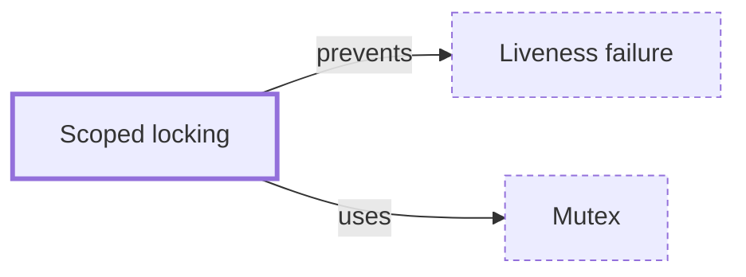

# Scoped locking

**Category:** [Synchronization](../README.md) · **Status:** stub · **Lessons:** [chapter 03, When locks go wrong](../../../03_When_Locks_Go_Wrong/README.md)

**One line:** Tying a lock's release to leaving a scope — a guard object, `defer`, `with`, `synchronized` — so that no path out of the code can forget to unlock.

Also called: lock guard, RAII guard, lock_guard, defer unlock.

## How it connects

- **Is built on:** [Mutex](../mutex/README.md)
- **Helps prevent:** [Liveness failure](../../hazards/liveness_failure/README.md)
- **See also:** [Lock poisoning](../lock_poisoning/README.md)

## In each language

| | |
|---|---|
| Rust | [`MutexGuard` ↗](https://doc.rust-lang.org/std/sync/struct.MutexGuard.html) is an RAII scoped lock: the mutex unlocks when the guard is dropped |
| Go | `defer mu.Unlock()` on the line after `Lock`: [deferred calls ↗](https://go.dev/ref/spec#Defer_statements) run however the function returns, a panic included — but the `defer` is a line you must remember |
| C++ | [`std::lock_guard` ↗](https://en.cppreference.com/w/cpp/thread/lock_guard) for one mutex, [`std::scoped_lock` ↗](https://en.cppreference.com/w/cpp/thread/scoped_lock) (C++17) for several, with deadlock avoidance |
| Java | [`synchronized` ↗](https://docs.oracle.com/javase/specs/jls/se25/html/jls-14.html#jls-14.19) blocks release on any exit; a [`Lock` ↗](https://docs.oracle.com/en/java/javase/25/docs/api/java.base/java/util/concurrent/locks/Lock.html) needs `unlock()` as the first statement of a `finally` block |
| Python | `with lock:` — [`threading` primitives ↗](https://docs.python.org/3/library/threading.html#using-locks-conditions-and-semaphores-in-the-with-statement) release when the block is exited |
| C# | The [`lock` statement ↗](https://learn.microsoft.com/en-us/dotnet/csharp/language-reference/statements/lock) expands to `try`/`finally`, or to `using (x.EnterScope())` for a `System.Threading.Lock` |
| JavaScript | [`navigator.locks.request` ↗](https://developer.mozilla.org/en-US/docs/Web/API/LockManager/request) releases the lock automatically when the callback returns or throws |
| Kotlin | [`Mutex.withLock` ↗](https://kotlinlang.org/api/kotlinx.coroutines/kotlinx-coroutines-core/kotlinx.coroutines.sync/with-lock.html) runs a block under the lock and releases it afterwards |

## Where to read more

- **In this library:** [Why do two locks taken in different orders hang?](../../../03_When_Locks_Go_Wrong/two_locks_in_different_orders/README.md)
- **In this library:** [Who unlocks when the function returns early?](../../../03_When_Locks_Go_Wrong/the_forgotten_unlock/README.md)
- **In a sibling library:** [Rust: Forgotten unlock ↗](https://masiarek.github.io/rust-learning-library/31_C_and_Cpp/forgotten_unlock/index.html)
- **In a sibling library:** [Go: A mutex guards a counter ↗](https://masiarek.github.io/go-learning-library/04_Sync/a_mutex_guards_a_counter/index.html)
- **In the books:** [*Rust Atomics and Locks*](../../../10_Resources/books_rust/README.md#bos_rust_atomics_and_locks), Mara Bos — ch. 4, 'Building Our Own Spin Lock' → 'A Safe Interface Using a Lock Guard'
- **Reference:** [Wikipedia: Resource acquisition is initialization ↗](https://en.wikipedia.org/wiki/Resource_acquisition_is_initialization)

<!-- Generated above this line by tools/build_concepts.py from TOML data — edit the data, not the page. Hand-written notes go below it and are kept. -->
