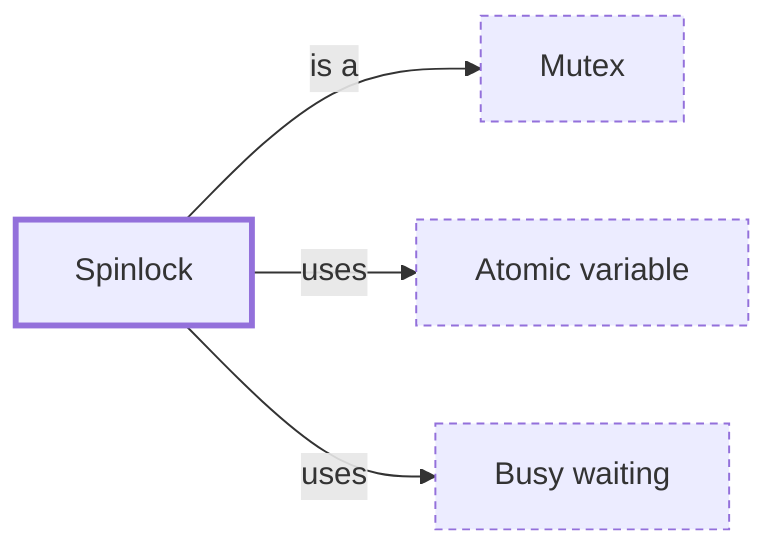

# Spinlock

**Category:** [Synchronization](../README.md) · **Status:** stub

**One line:** A lock that waits by looping and retrying instead of sleeping, which pays off only when it is held for very short times.

Also called: spin lock, spin-wait.

## How it connects

- **Is a kind of:** [Mutex](../mutex/README.md)
- **Is built on:** [Atomic variable](../../lock_free/atomic_variable/README.md), [Busy waiting](../../scheduling/busy_waiting/README.md)
- **See also:** [Busy waiting](../../scheduling/busy_waiting/README.md)

## In each language

| | |
|---|---|
| Rust | [`std::hint::spin_loop` ↗](https://doc.rust-lang.org/std/hint/fn.spin_loop.html) tells the processor it is running in a busy-wait spin loop |
| C++ | [`std::atomic_flag` ↗](https://en.cppreference.com/w/cpp/atomic/atomic_flag) is guaranteed lock-free; its page builds a spinlock from it and warns that spinlock mutexes are extremely dubious in practice |
| Java | [`Thread.onSpinWait` ↗](https://docs.oracle.com/en/java/javase/25/docs/api/java.base/java/lang/Thread.html) tells the runtime that a loop is busy-waiting |
| C# | [`SpinLock` ↗](https://learn.microsoft.com/en-us/dotnet/api/system.threading.spinlock): a thread that wants the lock waits in a loop, checking again until it is free |
| The operating system | POSIX [`pthread_spin_lock` ↗](https://pubs.opengroup.org/onlinepubs/9799919799/functions/pthread_spin_lock.html); in the Linux kernel the [spinlock ↗](https://docs.kernel.org/locking/spinlocks.html) is the most basic locking primitive |

## Where to read more

- **In this library:** [What does a spinlock cost when there is nowhere to spin?](../../../03_When_Locks_Go_Wrong/a_spinlock_on_one_core/README.md)
- **In the books:** [*Learn Concurrent Programming with Go*](../../../10_Resources/books_go/README.md#cutajar_learn_concurrent_programming_with_go), James Cutajar — ch. 12, 'Atomics, spin locks, and futexes'
- **In the books:** [*Rust Atomics and Locks*](../../../10_Resources/books_rust/README.md#bos_rust_atomics_and_locks), Mara Bos — ch. 4, 'Building Our Own Spin Lock'
- **In the books:** [*The Art of Multiprocessor Programming*](../../../10_Resources/books_general/README.md#herlihy_shavit_art_of_multiprocessor_programming), Maurice Herlihy, Nir Shavit — ch. 7, 'Spin Locks and Contention'
- **In the books:** [*Advanced Programming in the UNIX Environment*](../../../10_Resources/books_c/README.md#stevens_rago_apue), W. Richard Stevens, Stephen A. Rago — ch. 11, 'Threads' → 'Spin Locks'
- **Notes:** [Spinlock in general ↗](https://docs.google.com/document/d/1AsCfo4S41TPVABSCzq1PQ7EqdZZelfkiw2o7xS_OR6k/edit)
- **Reference:** [Wikipedia: Spinlock ↗](https://en.wikipedia.org/wiki/Spinlock)

<!-- Generated above this line by tools/build_concepts.py from TOML data — edit the data, not the page. Hand-written notes go below it and are kept. -->
