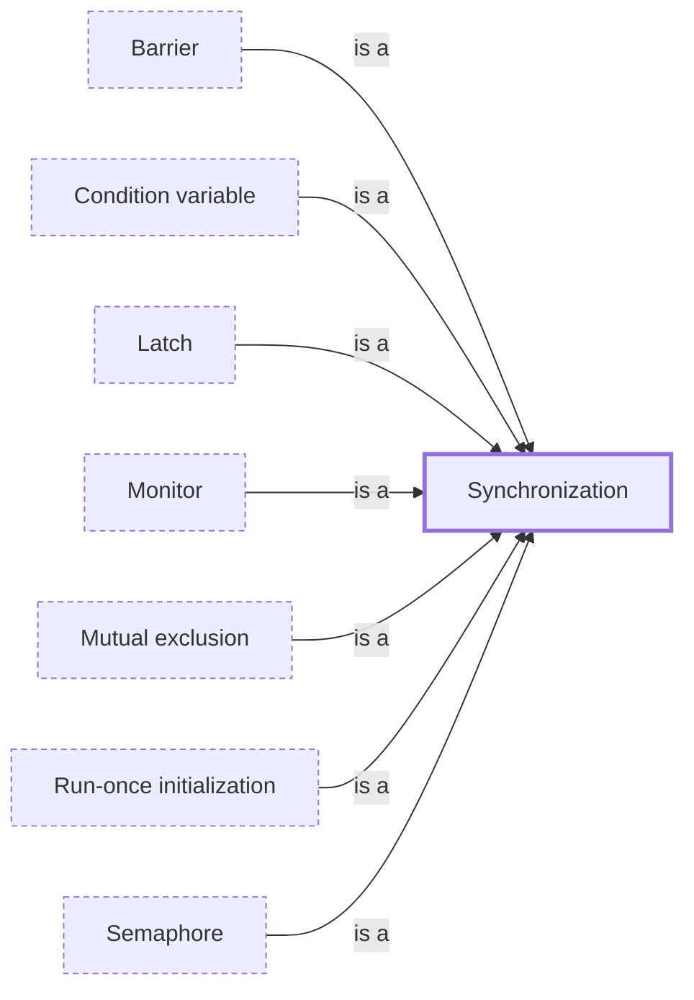

# Synchronization

**Category:** [Synchronization](../README.md) · **Status:** stub · **Lessons:** chapter 04, Waiting for each other *(planned)*

**One line:** Coordinating concurrent tasks so that their interactions happen safely — only one at a time, or one waiting until another is ready.

Also called: coordination, synchronization mechanisms, synchronization primitives.

## How it connects

- **Kinds:** [Barrier](../barrier/README.md), [Condition variable](../condition_variable/README.md), [Latch](../latch/README.md), [Monitor](../monitor/README.md), [Mutual exclusion](../mutual_exclusion/README.md), [Run-once initialization](../once_initialization/README.md), [Semaphore](../semaphore/README.md)

## In each language

| | |
|---|---|
| Rust | [`std::sync` ↗](https://doc.rust-lang.org/std/sync/index.html): `Mutex`, `RwLock`, `Condvar`, `Barrier`, `Once`, `OnceLock`, `LazyLock`, atomics and channels — but no semaphore |
| Go | [`sync` ↗](https://pkg.go.dev/sync) and [`sync/atomic` ↗](https://pkg.go.dev/sync/atomic); the [memory model ↗](https://go.dev/ref/mem) counts channel operations as synchronization too |
| C | [Concurrency support ↗](https://en.cppreference.com/w/c/thread) in C11 `<threads.h>`: mutexes, condition variables and `call_once` |
| C++ | [Concurrency support library ↗](https://en.cppreference.com/w/cpp/thread): mutexes, condition variables, semaphores, latches, futures and atomics |
| Java | [`java.util.concurrent` ↗](https://docs.oracle.com/en/java/javase/25/docs/api/java.base/java/util/concurrent/package-summary.html) synchronizers and locks, beside the `synchronized` keyword built into the language |
| Python | [`threading` ↗](https://docs.python.org/3/library/threading.html): `Lock`, `RLock`, `Condition`, `Semaphore`, `Event`, `Barrier`; the [`asyncio` primitives ↗](https://docs.python.org/3/library/asyncio-sync.html) look alike but are not thread-safe |
| C# | [Overview of synchronization primitives ↗](https://learn.microsoft.com/en-us/dotnet/standard/threading/overview-of-synchronization-primitives) in `System.Threading` |
| JavaScript | [`Atomics` ↗](https://developer.mozilla.org/en-US/docs/Web/JavaScript/Reference/Global_Objects/Atomics) for workers that share a `SharedArrayBuffer`; the [Web Locks API ↗](https://developer.mozilla.org/en-US/docs/Web/API/Web_Locks_API) across tabs and workers |
| Swift | The [Synchronization ↗](https://developer.apple.com/documentation/synchronization) module, with `Mutex` and `Atomic` |
| The operating system | Linux [futexes ↗](https://man7.org/linux/man-pages/man7/futex.7.html) are the building block for fast user-space locks and semaphores |

## Where to read more

- **Notes:** [synchronization mechanisms - coordinating multiple processes ↗](https://docs.google.com/document/d/1VAUhAJm1sdVCJvLVWwL1my9jNCqUu93dxxlfS6vwbSw/edit?tab=t.0)
- **Notes:** [coordination (managing interactions between concurrent - parallel tasks) ↗](https://docs.google.com/document/d/1shqvAb6zs3lOBd7lXRyvBP12C5TdcJCEe4zTge9T-pE/edit?tab=t.0)
- **Reference:** [Wikipedia: Synchronization (computer science) ↗](https://en.wikipedia.org/wiki/Synchronization_(computer_science))

<!-- Generated above this line by tools/build_concepts.py from TOML data — edit the data, not the page. Hand-written notes go below it and are kept. -->
