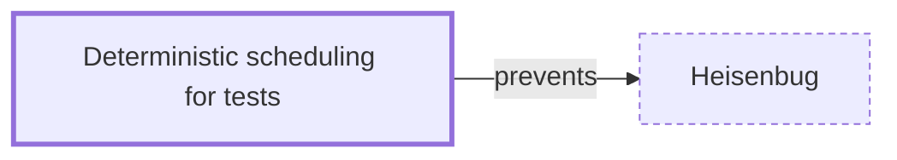

# Deterministic scheduling for tests

**Category:** [Testing and tools](../README.md) · **Status:** stub · **Lessons:** [chapter 09, Testing and tools](../../../09_Testing_and_Tools/README.md)

**One line:** Running concurrent code under a controlled scheduler or a fake clock, so that an interleaving or a timeout can be reproduced on demand — Rust's loom, Go's `testing/synctest`.

Also called: loom, synctest, deterministic simulation, virtual time.

## How it connects

- **Helps prevent:** [Heisenbug](../../hazards/heisenbug/README.md)
- **See also:** [Heisenbug](../../hazards/heisenbug/README.md), [Model checking](../model_checking/README.md)

## In each language

| | |
|---|---|
| Rust | [loom ↗](https://github.com/tokio-rs/loom) runs a test many times, permuting the possible concurrent executions of it |
| Go | [`testing/synctest` ↗](https://pkg.go.dev/testing/synctest), new in [Go 1.25 ↗](https://go.dev/doc/go1.25): a bubble with a fake clock, and `Wait` until every other goroutine in it is durably blocked |
| C# | Microsoft's [Coyote ↗](https://microsoft.github.io/coyote/) writes concurrency unit tests that control a .NET program's non-determinism |
| Kotlin | [`runTest` ↗](https://kotlinlang.org/api/kotlinx.coroutines/kotlinx-coroutines-test/) in kotlinx-coroutines-test skips delays using the virtual time of a `TestCoroutineScheduler` |

## Where to read more

- **In this library:** [How do you write a test that provokes the race?](../../../09_Testing_and_Tools/a_stress_test_that_actually_races/README.md)
- **In this library:** [How does a test wait an hour in a millisecond?](../../../09_Testing_and_Tools/virtual_time_in_tests/README.md)
- **In this library:** [Can every interleaving of a small program be checked?](../../../09_Testing_and_Tools/model_checking_a_small_program/README.md)
- **In a sibling library:** [Go: `synctest` makes time virtual ↗](https://masiarek.github.io/go-learning-library/07_Testing_Concurrent_Code/synctest_makes_time_virtual/index.html)
- **In a sibling library:** [Go: `synctest.Wait` instead of a sleep ↗](https://masiarek.github.io/go-learning-library/07_Testing_Concurrent_Code/synctest_wait/index.html)
- **In a sibling library:** [Rust: Testing async code ↗](https://masiarek.github.io/rust-learning-library/35_Async/building_minidb/testing_async_code/index.html)
- **In a sibling library:** [Rust: Testing against a hostile network ↗](https://masiarek.github.io/rust-learning-library/35_Async/building_minidb/testing_against_a_hostile_network/index.html)
- **In the books:** [*Async Rust*](../../../10_Resources/books_rust/README.md#flitton_morton_async_rust), Maxwell Flitton, Caroline Morton — ch. 11, 'Testing' → 'Mocking Async Code'
- **In the books:** [*Modern Multithreading*](../../../10_Resources/books_general/README.md#carver_tai_modern_multithreading), Richard H. Carver, Kuo-Chung Tai — ch. 2, 'The Critical Section Problem' → 'Tracing and Replay for Shared Variables'

<!-- Generated above this line by tools/build_concepts.py from TOML data — edit the data, not the page. Hand-written notes go below it and are kept. -->
