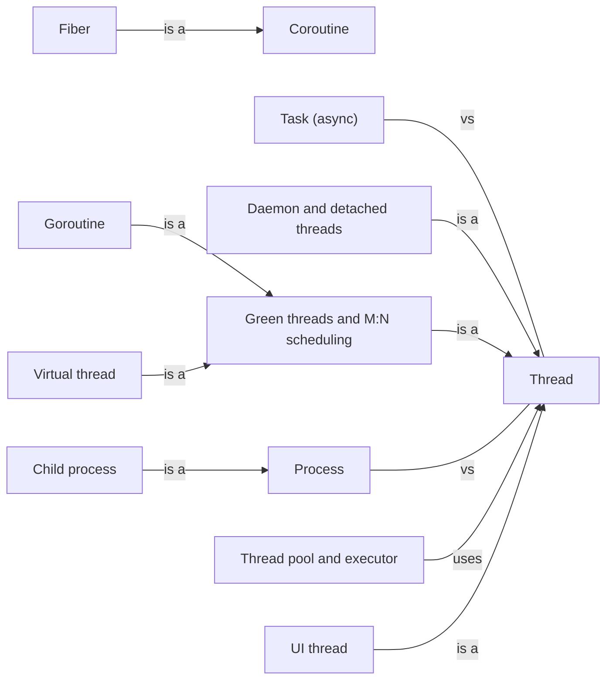

# Units of execution

The things that run: processes, threads, and the lighter units — goroutines, virtual threads, coroutines, tasks — that runtimes schedule on top of them.

[All categories](../README.md) · [How they connect](../schema/README.md)

- [Process](process/README.md) — A running program with its own address space, open files and at least one thread; two processes share nothing unless they arrange to.
    - [Child process](subprocess/README.md) — A process started by another program, which can pass it input, read its output, wait for it and learn how it ended.
- [Thread](thread/README.md) — A sequence of execution inside a process, with its own stack but sharing the process's memory with every other thread in it.
    - [Daemon and detached threads](daemon_thread/README.md) — A thread that does not keep its program alive: when the program ends, the thread is stopped wherever it happens to be.
    - [Green threads and M:N scheduling](green_thread/README.md) — Threads implemented by a language runtime instead of the operating system, many of them multiplexed onto a smaller number of OS threads.
        - [Goroutine](goroutine/README.md) — Go's unit of concurrency: a function call started with the `go` statement and scheduled by the Go runtime onto a small pool of operating-system threads.
        - [Virtual thread](virtual_thread/README.md) — Java's lightweight thread, final in JDK 21: a `Thread` that the JVM schedules onto a few carrier platform threads, cheap enough to start one per task.
    - [UI thread](ui_thread/README.md) — The one thread a graphical toolkit allows to touch its widgets: long work goes to other threads or tasks, and its results are posted back to that thread.
- [Coroutine](coroutine/README.md) — A function that can suspend itself part-way through and be resumed later from the same point, keeping its local state in between.
    - [Fiber](fiber/README.md) — A coroutine with its own stack that is switched to explicitly — the building block several green-thread runtimes are made of.
- [Task (async)](async_task/README.md) — A unit of async work handed to a runtime — a future being driven to completion — far cheaper than a thread because it holds no stack of its own while it waits.
- [Thread pool and executor](thread_pool/README.md) — A set of threads that run submitted tasks one after another, so the cost of starting a thread is paid once rather than once per task.
- [Context switch](context_switch/README.md) — Saving one thread's or process's CPU state and loading another's so that it can run; switching between threads is cheaper than between processes, and between async tasks cheaper still.
- [Thread-local storage](thread_local_storage/README.md) — A variable with a separate copy per thread, so each thread sees only its own value and no lock is needed.

## Inside this category

<!-- Generated above this line by tools/build_concepts.py from TOML data — edit the data, not the page. Hand-written notes go below it and are kept. -->
