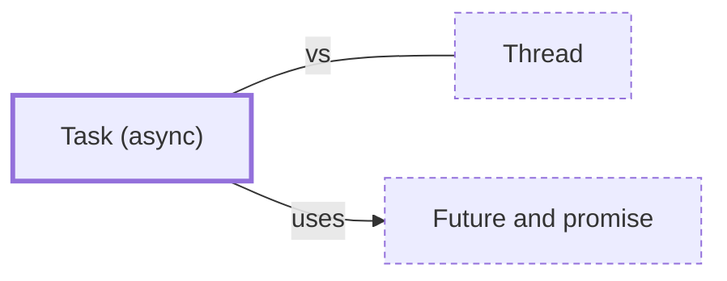

# Task (async)

**Category:** [Units of execution](../README.md) · **Status:** stub · **Lessons:** chapter 06, Async *(planned)*

**One line:** A unit of async work handed to a runtime — a future being driven to completion — far cheaper than a thread because it holds no stack of its own while it waits.

Also called: task, spawned future.

## How it connects

- **Is built on:** [Future and promise](../../async/future_and_promise/README.md)
- **Often confused with:** [Thread](../thread/README.md)
- **See also:** [Async runtime (executor and reactor)](../../scheduling/async_runtime/README.md), [Thread-local storage](../thread_local_storage/README.md)

## In each language

| | |
|---|---|
| Rust | [`tokio::spawn` ↗](https://docs.rs/tokio/latest/tokio/task/fn.spawn.html) hands a future to the Tokio runtime and returns a `JoinHandle` |
| Python | [`asyncio.create_task` ↗](https://docs.python.org/3/library/asyncio-task.html#asyncio.create_task); keep a reference to the task, since the event loop holds only a weak one |
| C# | [`Task` ↗](https://learn.microsoft.com/en-us/dotnet/api/system.threading.tasks.task) represents an asynchronous operation |
| JavaScript | Calling an [`async` function ↗](https://developer.mozilla.org/en-US/docs/Web/JavaScript/Reference/Statements/async_function) runs it synchronously up to its first `await` and returns a `Promise` |
| Kotlin | [`async` ↗](https://kotlinlang.org/api/kotlinx.coroutines/kotlinx-coroutines-core/kotlinx.coroutines/async.html) returns a `Deferred` with a result; [`launch` ↗](https://kotlinlang.org/api/kotlinx.coroutines/kotlinx-coroutines-core/kotlinx.coroutines/launch.html) returns a `Job` |
| Swift | [`Task` ↗](https://developer.apple.com/documentation/swift/task), a unit of asynchronous work |
| Erlang and Elixir | [`Task.async` ↗](https://hexdocs.pm/elixir/Task.html#async/1) starts a process linked to the caller, and `Task.await` receives its reply |
| Haskell | [`async` ↗](https://hackage.haskell.org/package/async/docs/Control-Concurrent-Async.html#v:async) runs an `IO` action in a separate thread and returns an `Async` handle |

## Where to read more

- **In a sibling library:** [Rust: Tasks ↗](https://masiarek.github.io/rust-learning-library/35_Async/building_minidb/tasks/index.html)
- **In the books:** [*Concurrency in .NET*](../../../10_Resources/books_csharp_dotnet/README.md#terrell_concurrency_in_dotnet), Riccardo Terrell — ch. 7, 'Task-based functional parallelism'
- **In the books:** [*Python Asyncio Jump-Start*](../../../10_Resources/books_python/README.md#brownlee_python_asyncio_jump_start), Jason Brownlee — ch. 2, 'Coroutines and Tasks'
- **In the books:** [*Pro Asynchronous Programming with .NET*](../../../10_Resources/books_csharp_dotnet/README.md#blewett_clymer_pro_asynchronous_programming_dotnet), Richard Blewett, Andrew Clymer — ch. 3, 'Tasks'
- **In the books:** [*Async Rust*](../../../10_Resources/books_rust/README.md#flitton_morton_async_rust), Maxwell Flitton, Caroline Morton — ch. 2, 'Basic Async Rust' → 'Understanding Tasks'
- **In the books:** [*Concurrency with Modern C++*](../../../10_Resources/books_cpp/README.md#grimm_concurrency_with_modern_cpp), Rainer Grimm — ch. 3, 'Multithreading' → 'Tasks'
- **In the books:** [*C++ Reactive Programming*](../../../10_Resources/books_cpp/README.md#pai_abraham_cpp_reactive_programming), Praseed Pai, Peter Abraham — ch. 4, 'Asynchronous and Lock-Free Programming in C++' → 'Task-based parallelism in C++'

<!-- Generated above this line by tools/build_concepts.py from TOML data — edit the data, not the page. Hand-written notes go below it and are kept. -->
