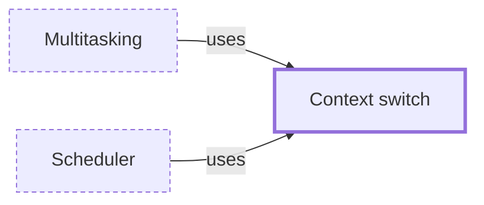

# Context switch

**Category:** [Units of execution](../README.md) · **Status:** stub

**One line:** Saving one thread's or process's CPU state and loading another's so that it can run; switching between threads is cheaper than between processes, and between async tasks cheaper still.

Also called: task switch.

## How it connects

- **Is used by:** [Multitasking](../../foundations/multitasking/README.md), [Scheduler](../../scheduling/scheduler/README.md)
- **See also:** [Oversubscription](../../foundations/oversubscription/README.md), [Preemptive scheduling](../../scheduling/preemptive_scheduling/README.md), [Process](../process/README.md), [Scheduler](../../scheduling/scheduler/README.md)

## In each language

| | |
|---|---|
| Rust | [`std::thread::yield_now` ↗](https://doc.rust-lang.org/std/thread/fn.yield_now.html) gives up the rest of a time slice |
| Go | [`runtime.Gosched` ↗](https://pkg.go.dev/runtime#Gosched) yields the processor to other goroutines |
| C++ | [`std::this_thread::yield` ↗](https://en.cppreference.com/w/cpp/thread/yield) |
| Java | [`Thread.yield` ↗](https://docs.oracle.com/en/java/javase/25/docs/api/java.base/java/lang/Thread.html#yield%28%29), which its documentation says is rarely appropriate to use |
| The operating system | [`sched_yield(2)` ↗](https://man7.org/linux/man-pages/man2/sched_yield.2.html); [`/proc/pid/status` ↗](https://man7.org/linux/man-pages/man5/proc_pid_status.5.html) counts a process's voluntary and involuntary switches |

## Where to read more

- **In this library:** [What is a goroutine, if not a thread?](../../../01_Threads/a_goroutine_is_not_a_thread/README.md)
- **In this library:** [What does a spinlock cost when there is nowhere to spin?](../../../03_When_Locks_Go_Wrong/a_spinlock_on_one_core/README.md)
- **In this library:** [How many workers should a pool have?](../../../07_Parallelism/how_many_workers/README.md)
- **In the books:** [*Java Concurrency in Practice*](../../../10_Resources/books_java/README.md#goetz_java_concurrency_in_practice), Brian Goetz, Tim Peierls, Joshua Bloch, Joseph Bowbeer, David Holmes, Doug Lea — ch. 11, 'Performance and Scalability' → 'Reducing Context Switch Overhead'
- **Notes:** [Difference between Thread Context Switch and Process Context Switch ↗](https://docs.google.com/document/u/0/d/1SCJjKfXjd-HhXqBSUDNCobjTHcrqmYURRgZUtaJSCbw/edit)
- **Notes:** [context switching - general ↗](https://docs.google.com/document/u/0/d/1o8StLlChfE11FyBBzKiqNBbu2xAUz2RfX-w_nwmqhQY/edit)
- **Notes:** [thread suspension ↗](https://docs.google.com/document/d/1bsfSdHUmJpNIzQsT401GsVrtWj-VzLBrJvd8OSf2-OI/edit?tab=t.0)
- **Reference:** [Wikipedia: Context switch ↗](https://en.wikipedia.org/wiki/Context_switch)

<!-- Generated above this line by tools/build_concepts.py from TOML data — edit the data, not the page. Hand-written notes go below it and are kept. -->
