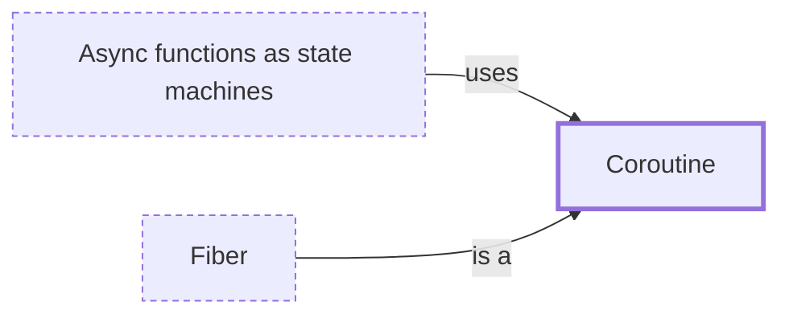

# Coroutine

**Category:** [Units of execution](../README.md) · **Status:** stub · **Lessons:** [chapter 06, Async](../../../06_Async/README.md)

**One line:** A function that can suspend itself part-way through and be resumed later from the same point, keeping its local state in between.

Also called: asymmetric coroutine, symmetric coroutine, generator, stackless coroutine.

## How it connects

- **Kinds:** [Fiber](../fiber/README.md)
- **Is used by:** [Async functions as state machines](../../async/async_state_machine/README.md)
- **See also:** [Async and await](../../async/async_await/README.md), [Green threads and M:N scheduling](../green_thread/README.md), [Suspension point](../../scheduling/suspension_point/README.md)

## In each language

| | |
|---|---|
| Rust | `async` blocks produce a [`Future` ↗](https://doc.rust-lang.org/std/future/trait.Future.html); general [coroutines ↗](https://doc.rust-lang.org/unstable-book/language-features/coroutines.html) are unstable |
| C++ | C++20 [coroutines ↗](https://en.cppreference.com/w/cpp/language/coroutines) are stackless, with `co_await`, `co_yield` and `co_return`; C++23 adds [`std::generator` ↗](https://en.cppreference.com/w/cpp/coroutine/generator) |
| Python | [Coroutines ↗](https://docs.python.org/3/glossary.html#term-coroutine) are written with `async def`; [generators ↗](https://docs.python.org/3/glossary.html#term-generator) with `yield` are the other kind |
| C# | Iterators with [`yield return` ↗](https://learn.microsoft.com/en-us/dotnet/csharp/language-reference/statements/yield), and `async` methods |
| JavaScript | [Generator functions ↗](https://developer.mozilla.org/en-US/docs/Web/JavaScript/Reference/Statements/function*) (`function*`, `yield`) and `async` functions |
| Kotlin | [Coroutines ↗](https://kotlinlang.org/docs/coroutines-basics.html): the language supplies `suspend`, and builders such as `launch` come from `kotlinx.coroutines` |
| Elsewhere | Lua's [coroutines ↗](https://www.lua.org/manual/5.4/manual.html#2.6), also called collaborative multithreading, suspend only by explicitly calling a yield function |

## Where to read more

- **In this library:** [What is a goroutine, if not a thread?](../../../01_Threads/a_goroutine_is_not_a_thread/README.md)
- **In this library:** [What happens at an await?](../../../06_Async/async_and_await/README.md)
- **In this library:** [How does a loop await a sequence of values that arrive over time?](../../../06_Async/an_async_stream/README.md)
- **In the books:** [*Async Rust*](../../../10_Resources/books_rust/README.md#flitton_morton_async_rust), Maxwell Flitton, Caroline Morton — ch. 5, 'Coroutines'
- **In the books:** [*Concurrency with Modern C++*](../../../10_Resources/books_cpp/README.md#grimm_concurrency_with_modern_cpp), Rainer Grimm — ch. 6, 'The Future: C++20/23' → 'Coroutines'
- **In the books:** [*Python Concurrency with asyncio*](../../../10_Resources/books_python/README.md#fowler_python_concurrency_with_asyncio), Matthew Fowler — ch. 2, 'asyncio basics' → 'Introducing coroutines'
- **In the books:** [*JavaScript Concurrency*](../../../10_Resources/books_javascript/README.md#boduch_javascript_concurrency), Adam Boduch — ch. 4, 'Lazy Evaluation with Generators' → 'Coroutines'
- **In the books:** [*Kotlin Coroutines by Tutorials*](../../../10_Resources/books_other/README.md#babic_srivastava_kotlin_coroutines_by_tutorials), Filip Babić, Nishant Srivastava — ch. 1, 'What Is Asynchronous Programming' → 'Explaining coroutines: The inner works'
- **In the books:** [*Asynchronous Programming in Rust*](../../../10_Resources/books_rust/README.md#samson_asynchronous_programming_in_rust), Carl Fredrik Samson — ch. 2, 'How Programming Languages Model Asynchronous Program Flow' → 'Coroutines: promises and futures'
- **Notes:** [coroutine - python - async ↗](https://docs.google.com/document/d/1VYbPExkcfz9f-JmjIDpyLxTKXkSKFwlW7BRelaZDIGk/edit?tab=t.0)
- **Reference:** [Wikipedia: Coroutine ↗](https://en.wikipedia.org/wiki/Coroutine)

<!-- Generated above this line by tools/build_concepts.py from TOML data — edit the data, not the page. Hand-written notes go below it and are kept. -->
