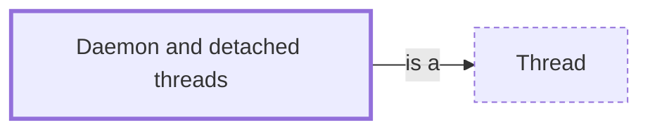

# Daemon and detached threads

**Category:** [Units of execution](../README.md) · **Status:** stub · **Lessons:** [chapter 01, Threads](../../../01_Threads/README.md)

**One line:** A thread that does not keep its program alive: when the program ends, the thread is stopped wherever it happens to be.

Also called: daemon thread, detached thread, background thread.

## How it connects

- **Is a kind of:** [Thread](../thread/README.md)
- **See also:** [Detached thread](../detached_thread/README.md), [Goroutine](../goroutine/README.md), [Join](../../async/join/README.md), [Virtual thread](../virtual_thread/README.md)

## In each language

| | |
|---|---|
| Rust | Dropping a [`JoinHandle` ↗](https://doc.rust-lang.org/std/thread/struct.JoinHandle.html) detaches its thread, and [every thread ends when `main` does ↗](https://doc.rust-lang.org/std/thread/index.html#the-threading-model) |
| Go | Every goroutine behaves this way: [when `main` returns the program exits ↗](https://go.dev/ref/spec#Program_execution), without waiting for other goroutines |
| C | [`pthread_detach` ↗](https://pubs.opengroup.org/onlinepubs/9799919799/functions/pthread_detach.html) means nobody will join the thread; after [`pthread_exit` ↗](https://pubs.opengroup.org/onlinepubs/9799919799/functions/pthread_exit.html) the process exits with status 0 once the last thread has ended |
| C++ | [`std::thread::detach` ↗](https://en.cppreference.com/w/cpp/thread/thread/detach) lets the thread run on after its `std::thread` object is gone |
| Java | [`Thread.setDaemon` ↗](https://docs.oracle.com/en/java/javase/25/docs/api/java.base/java/lang/Thread.html#setDaemon%28boolean%29); the JVM does not wait for daemon threads, and virtual threads are always daemons |
| Python | [`daemon=True` ↗](https://docs.python.org/3/library/threading.html#threading.Thread.daemon); the interpreter waits for non-daemon threads, and daemon threads are stopped abruptly at shutdown |
| C# | [`Thread.IsBackground` ↗](https://learn.microsoft.com/en-us/dotnet/api/system.threading.thread.isbackground): background threads do not keep a process running |
| Haskell | Every [`forkIO` ↗](https://hackage.haskell.org/package/base/docs/Control-Concurrent.html#v:forkIO) thread is daemonic: the program ends when the main thread does, and waiting for the others is written by hand, for instance with an `MVar` |

## Where to read more

- **In this library:** [Who waits when main returns?](../../../01_Threads/who_waits_when_main_returns/README.md)
- **In this library:** [What does a failure on a thread do when nobody is waiting for it?](../../../01_Threads/a_failure_nobody_is_waiting_for/README.md)
- **In a sibling library:** [Go: `main` does not wait ↗](https://masiarek.github.io/go-learning-library/01_Goroutines/main_does_not_wait/index.html)
- **In the books:** [*Async Rust*](../../../10_Resources/books_rust/README.md#flitton_morton_async_rust), Maxwell Flitton, Caroline Morton — ch. 3, 'Building Our Own Async Queues' → 'Running Background Processes'
- **In the books:** [*Parallel Programming and Concurrency with C# 10 and .NET 6*](../../../10_Resources/books_csharp_dotnet/README.md#ashcraft_parallel_programming_concurrency_csharp10), Alvin Ashcraft — ch. 4, 'User Interface Responsiveness and Threading' → 'Leveraging background threads'
- **In the books:** [*The Go Programming Language Phrasebook*](../../../10_Resources/books_go/README.md#chisnall_go_phrasebook), David Chisnall — ch. 9, 'Goroutines' → 'Performing Actions in the Background'
- **In the books:** [*The Linux Programming Interface*](../../../10_Resources/books_c/README.md#kerrisk_linux_programming_interface), Michael Kerrisk — ch. 29, 'Threads: Introduction' → 'Detaching a Thread'
- **In the books:** [*Pthreads Programming*](../../../10_Resources/books_c/README.md#nichols_pthreads_programming), Bradford Nichols, Dick Buttlar, Jacqueline Proulx Farrell — ch. B, 'Pthreads Draft 4 vs. the Final Standard' → 'Detaching a Thread'

<!-- Generated above this line by tools/build_concepts.py from TOML data — edit the data, not the page. Hand-written notes go below it and are kept. -->
