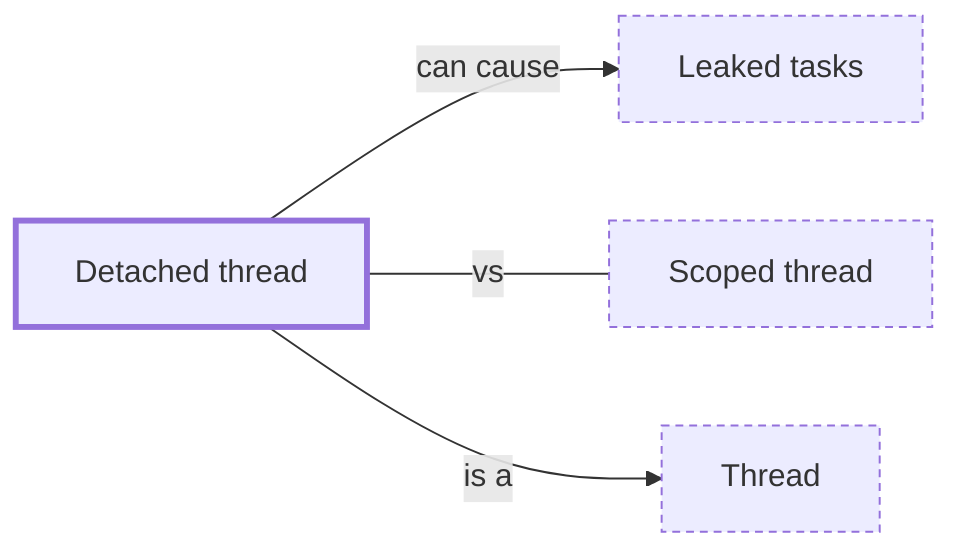

# Detached thread

**Category:** [Units of execution](../README.md) · **Status:** stub · **Lessons:** [chapter 01, Threads](../../../01_Threads/README.md)

**One line:** A thread nobody will join: its result is unreachable, its end is unobserved, and whatever it borrowed must outlive it by some other argument.

Also called: detach, fire and forget.

## How it connects

- **Is a kind of:** [Thread](../thread/README.md)
- **Can lead to:** [Leaked tasks](../../hazards/task_leak/README.md)
- **Often confused with:** [Scoped thread](../scoped_thread/README.md)
- **See also:** [Daemon and detached threads](../daemon_thread/README.md), [Object lifetime](../../safety_in_languages/object_lifetime/README.md)

## In each language

| | |
|---|---|
| Rust | Dropping a [`JoinHandle` ↗](https://doc.rust-lang.org/std/thread/struct.JoinHandle.html) detaches its thread; the `'static` bound on [`thread::spawn` ↗](https://doc.rust-lang.org/std/thread/fn.spawn.html) is what makes that safe |
| Go | Every goroutine is detached: a [go statement ↗](https://go.dev/ref/spec#Go_statements) yields no handle, and a `sync.WaitGroup` or a channel is how a program waits |
| C | [`pthread_detach` ↗](https://pubs.opengroup.org/onlinepubs/9799919799/functions/pthread_detach.html) marks a thread unjoinable and lets its storage be reclaimed as it ends |
| C++ | [`std::thread::detach` ↗](https://en.cppreference.com/w/cpp/thread/thread/detach); a `std::thread` destroyed while still joinable calls [`std::terminate` ↗](https://en.cppreference.com/w/cpp/error/terminate) |
| Python | [`Thread(daemon=True)` ↗](https://docs.python.org/3/library/threading.html#threading.Thread.daemon) is not waited for at exit |

## Where to read more

- **In this library:** [Who waits when main returns?](../../../01_Threads/who_waits_when_main_returns/README.md)
- **In this library:** [Can a thread borrow a local variable?](../../../01_Threads/lending_a_local_to_a_thread/README.md)
- **Reference:** [POSIX: pthread_detach ↗](https://pubs.opengroup.org/onlinepubs/9799919799/functions/pthread_detach.html)

<!-- Generated above this line by tools/build_concepts.py from TOML data — edit the data, not the page. Hand-written notes go below it and are kept. -->
