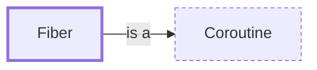

# Fiber

**Category:** [Units of execution](../README.md) · **Status:** stub

**One line:** A coroutine with its own stack that is switched to explicitly — the building block several green-thread runtimes are made of.

Also called: stackful coroutine.

## How it connects

- **Is a kind of:** [Coroutine](../coroutine/README.md)
- **See also:** [Green threads and M:N scheduling](../green_thread/README.md)

## In each language

| | |
|---|---|
| The operating system | [Fibers ↗](https://learn.microsoft.com/en-us/windows/win32/procthread/fibers) in the Windows API; POSIX removed [`makecontext` and `swapcontext` ↗](https://man7.org/linux/man-pages/man3/makecontext.3.html) from the standard |
| Elsewhere | Ruby's [`Fiber` ↗](https://docs.ruby-lang.org/en/master/Fiber.html), and PHP's [Fibers ↗](https://www.php.net/manual/en/language.fibers.php) since PHP 8.1 |

## Where to read more

- **In the books:** [*Concurrent Programming on Windows*](../../../10_Resources/books_csharp_dotnet/README.md#duffy_concurrent_programming_on_windows), Joe Duffy — ch. 9, 'Fibers'
- **In the books:** [*Asynchronous Programming in Rust*](../../../10_Resources/books_rust/README.md#samson_asynchronous_programming_in_rust), Carl Fredrik Samson — ch. 2, 'How Programming Languages Model Asynchronous Program Flow' → 'Fibers and green threads'
- **In the books:** [*Async JavaScript*](../../../10_Resources/books_javascript/README.md#burnham_async_javascript), Trevor Burnham — ch. A1, 'Tools for Taming JavaScript' → 'Node-Fibers'
- **Reference:** [Wikipedia: Fiber (computer science) ↗](https://en.wikipedia.org/wiki/Fiber_(computer_science))

<!-- Generated above this line by tools/build_concepts.py from TOML data — edit the data, not the page. Hand-written notes go below it and are kept. -->
