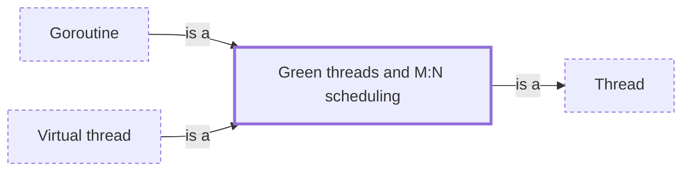

# Green threads and M:N scheduling

**Category:** [Units of execution](../README.md) · **Status:** stub

**One line:** Threads implemented by a language runtime instead of the operating system, many of them multiplexed onto a smaller number of OS threads.

Also called: user-space threads, M:N threading, lightweight threads.

## How it connects

- **Is a kind of:** [Thread](../thread/README.md)
- **Kinds:** [Goroutine](../goroutine/README.md), [Virtual thread](../virtual_thread/README.md)
- **See also:** [Coroutine](../coroutine/README.md), [Fiber](../fiber/README.md), [Scheduler](../../scheduling/scheduler/README.md)

## In each language

| | |
|---|---|
| Rust | Standard threads are [native OS threads ↗](https://doc.rust-lang.org/std/thread/index.html); M:N scheduling of tasks comes from an async runtime such as [Tokio's ↗](https://docs.rs/tokio/latest/tokio/runtime/index.html) |
| Go | Goroutines are M:N: [multiplexed onto a set of OS threads ↗](https://go.dev/doc/faq#goroutines) |
| Java | [Virtual threads ↗](https://docs.oracle.com/en/java/javase/25/docs/api/java.base/java/lang/Thread.html#virtual-threads) (JDK 21) are scheduled by the Java runtime rather than the operating system |
| Kotlin | Coroutines are sent to threads by [dispatchers ↗](https://kotlinlang.org/docs/coroutine-context-and-dispatchers.html) |
| Erlang and Elixir | Processes are M:N, run by [scheduler threads ↗](https://www.erlang.org/doc/apps/erts/erl_cmd.html) inside the VM |
| Haskell | [`forkIO` ↗](https://hackage.haskell.org/package/base/docs/Control-Concurrent.html#v:forkIO) threads are lightweight, scheduled by the GHC runtime rather than the OS |

## Where to read more

- **In this library:** [How many threads can you start?](../../../01_Threads/how_many_threads_can_you_start/README.md)
- **In this library:** [What is a goroutine, if not a thread?](../../../01_Threads/a_goroutine_is_not_a_thread/README.md)
- **In a sibling library:** [Go: Goroutines are cheap ↗](https://masiarek.github.io/go-learning-library/01_Goroutines/goroutines_are_cheap/index.html)
- **In the books:** [*Asynchronous Programming in Rust*](../../../10_Resources/books_rust/README.md#samson_asynchronous_programming_in_rust), Carl Fredrik Samson — ch. 2, 'How Programming Languages Model Asynchronous Program Flow' → 'Fibers and green threads'
- **In the books:** [*Systems Programming in Unix/Linux*](../../../10_Resources/books_c/README.md#wang_systems_programming_unix_linux), K. C. Wang — ch. 4, 'Concurrent Programming' → 'Programming Project: User-Level Threads'
- **Reference:** [Wikipedia: Green thread ↗](https://en.wikipedia.org/wiki/Green_thread)

<!-- Generated above this line by tools/build_concepts.py from TOML data — edit the data, not the page. Hand-written notes go below it and are kept. -->
