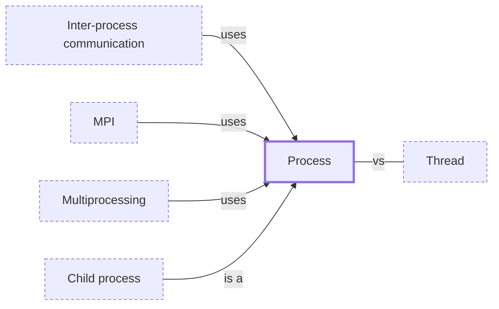

# Process

**Category:** [Units of execution](../README.md) · **Status:** stub · **Lessons:** chapter 08, Processes *(planned)*

**One line:** A running program with its own address space, open files and at least one thread; two processes share nothing unless they arrange to.

Also called: OS process.

## How it connects

- **Kinds:** [Child process](../subprocess/README.md)
- **Is used by:** [Inter-process communication](../../communication/ipc/README.md), [MPI](../../parallelism/mpi/README.md), [Multiprocessing](../../parallelism/multiprocessing/README.md)
- **Often confused with:** [Thread](../thread/README.md)
- **See also:** [Context switch](../context_switch/README.md), [Inter-process communication](../../communication/ipc/README.md), [Multiprocessing](../../parallelism/multiprocessing/README.md)

## In each language

| | |
|---|---|
| Rust | [`std::process::Command` ↗](https://doc.rust-lang.org/std/process/struct.Command.html) spawns a child process and returns a [`Child` ↗](https://doc.rust-lang.org/std/process/struct.Child.html) |
| Go | [`os/exec` ↗](https://pkg.go.dev/os/exec) runs an external command |
| C | [`fork` ↗](https://pubs.opengroup.org/onlinepubs/9799919799/functions/fork.html) copies the calling process but only the thread that called it; [`posix_spawn` ↗](https://pubs.opengroup.org/onlinepubs/9799919799/functions/posix_spawn.html) starts a new program |
| Java | [`ProcessBuilder` ↗](https://docs.oracle.com/en/java/javase/25/docs/api/java.base/java/lang/ProcessBuilder.html) starts a [`Process` ↗](https://docs.oracle.com/en/java/javase/25/docs/api/java.base/java/lang/Process.html); [`ProcessHandle` ↗](https://docs.oracle.com/en/java/javase/25/docs/api/java.base/java/lang/ProcessHandle.html) (Java 9) inspects any process |
| Python | [`subprocess` ↗](https://docs.python.org/3/library/subprocess.html) runs programs; [`multiprocessing` ↗](https://docs.python.org/3/library/multiprocessing.html) runs Python functions in child processes |
| C# | [`Process.Start` ↗](https://learn.microsoft.com/en-us/dotnet/api/system.diagnostics.process.start) |
| Erlang and Elixir | An external program is reached through a [port ↗](https://www.erlang.org/doc/system/ports.html), and runs in another OS process |
| The operating system | [`fork(2)` ↗](https://man7.org/linux/man-pages/man2/fork.2.html) and [`execve(2)` ↗](https://man7.org/linux/man-pages/man2/execve.2.html); on Linux [`clone(2)` ↗](https://man7.org/linux/man-pages/man2/clone.2.html) creates processes and threads alike |

## Where to read more

- **In this library:** [Who waits when main returns?](../../../01_Threads/who_waits_when_main_returns/README.md)
- **In a sibling library:** [Linux: head closes the pipe early ↗](https://masiarek.github.io/linux-learning-library/01_Pipelines/head_closes_the_pipe_early/index.html)
- **In the books:** [*The Little Elixir & OTP Guidebook*](../../../10_Resources/books_elixir_erlang/README.md#tan_little_elixir_otp_guidebook), Benjamin Tan Wei Hao — ch. 3, 'Processes 101'
- **In the books:** [*Learn Concurrent Programming with Go*](../../../10_Resources/books_go/README.md#cutajar_learn_concurrent_programming_with_go), James Cutajar — ch. 2, 'Dealing with threads' → 'Abstracting concurrency with processes and threads'
- **In the books:** [*Async Rust*](../../../10_Resources/books_rust/README.md#flitton_morton_async_rust), Maxwell Flitton, Caroline Morton — ch. 1, 'Introduction to Async' → 'Introduction to Processes'
- **In the books:** [*Mastering C++ Multithreading*](../../../10_Resources/books_cpp/README.md#posch_mastering_cpp_multithreading), Maya Posch — ch. 2, 'Multithreading Implementation on the Processor and OS' → 'Defining processes and threads'
- **In the books:** [*Learning Concurrent Programming in Scala*](../../../10_Resources/books_scala_jvm_functional/README.md#prokopec_learning_concurrent_programming_in_scala), Aleksandar Prokopec — ch. 2, 'Concurrency on the JVM and the Java Memory Model' → 'Processes and threads'
- **In the books:** [*Python Concurrency with asyncio*](../../../10_Resources/books_python/README.md#fowler_python_concurrency_with_asyncio), Matthew Fowler — ch. 1, 'Getting to know asyncio' → 'Understanding processes, threads, multithreading, and multiprocessing'
- **Notes:** [processes and the operating system ↗](https://docs.google.com/document/d/1HwQOUG5CZYqFcLTjpyTbDqXCx753PxesnMEa69Y09pM/edit?tab=t.0)
- **Notes:** [process - rust ↗](https://docs.google.com/document/d/12slQV5W0Nnu16WPelT4LOTtCiEZGk39kI-5ZS-tczOU/edit?tab=t.0)
- **Notes:** [exit - function - rust - std::process::exit ↗](https://docs.google.com/document/u/0/d/1k-s4WLlQ4f3M7leYOgCHCere0fxavnIxwWYPddMxsQg/edit)
- **Notes:** [how the CPU interacts with processes and threads ↗](https://docs.google.com/document/u/0/d/1l0y3Zy3fKsIhcYkWkeqiitgQEP-uMEyceIWqsZoRkig/edit)
- **Reference:** [Wikipedia: Process (computing) ↗](https://en.wikipedia.org/wiki/Process_(computing))

<!-- Generated above this line by tools/build_concepts.py from TOML data — edit the data, not the page. Hand-written notes go below it and are kept. -->
