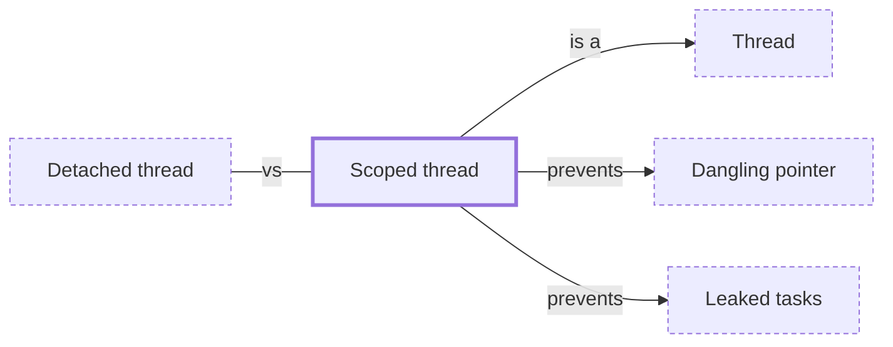

# Scoped thread

**Category:** [Units of execution](../README.md) · **Status:** stub · **Lessons:** [chapter 01, Threads](../../../01_Threads/README.md)

**One line:** A thread whose life is bounded by a block: the block cannot be left until the thread has been joined, which is what lets the thread borrow the block's own local variables.

Also called: structured thread, thread::scope.

## How it connects

- **Is a kind of:** [Thread](../thread/README.md)
- **Helps prevent:** [Dangling pointer](../../hazards/dangling_pointer/README.md), [Leaked tasks](../../hazards/task_leak/README.md)
- **Often confused with:** [Detached thread](../detached_thread/README.md)
- **See also:** [Join](../../async/join/README.md), [Object lifetime](../../safety_in_languages/object_lifetime/README.md), [Structured concurrency](../../async/structured_concurrency/README.md)

## In each language

| | |
|---|---|
| Rust | [`thread::scope` ↗](https://doc.rust-lang.org/std/thread/fn.scope.html) joins every thread started inside it before returning, so a scoped thread may borrow the caller's locals and needs no `'static` bound |
| C++ | [`std::jthread` ↗](https://en.cppreference.com/w/cpp/thread/jthread) joins in its destructor, which bounds the thread by the enclosing block — but nothing checks what the thread captured |
| Java | [JEP 505: Structured Concurrency ↗](https://openjdk.org/jeps/505) scopes a set of tasks to a block that does not exit until all of them have finished |
| Python | [`ThreadPoolExecutor` ↗](https://docs.python.org/3/library/concurrent.futures.html#threadpoolexecutor) used as a context manager waits for its threads at the end of the `with` block |

## Where to read more

- **In this library:** [Can a thread borrow a local variable?](../../../01_Threads/lending_a_local_to_a_thread/README.md)
- **Reference:** [Wikipedia: Structured concurrency ↗](https://en.wikipedia.org/wiki/Structured_concurrency)

<!-- Generated above this line by tools/build_concepts.py from TOML data — edit the data, not the page. Hand-written notes go below it and are kept. -->
