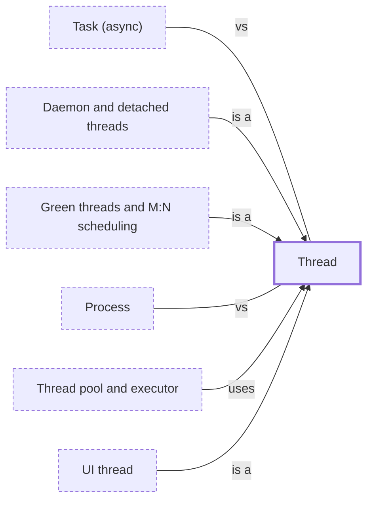

# Thread

**Category:** [Units of execution](../README.md) · **Status:** stub · **Lessons:** [chapter 01, Threads](../../../01_Threads/README.md)

**One line:** A sequence of execution inside a process, with its own stack but sharing the process's memory with every other thread in it.

Also called: thread of execution, OS thread, platform thread, multithreading.

## How it connects

- **Kinds:** [Daemon and detached threads](../daemon_thread/README.md), [Green threads and M:N scheduling](../green_thread/README.md), [UI thread](../ui_thread/README.md)
- **Is used by:** [Thread pool and executor](../thread_pool/README.md)
- **Often confused with:** [Process](../process/README.md), [Task (async)](../async_task/README.md)
- **See also:** [Concurrency primitives](../../foundations/concurrency_primitives/README.md), [Scheduler](../../scheduling/scheduler/README.md)

## In each language

| | |
|---|---|
| Rust | [`std::thread::spawn` ↗](https://doc.rust-lang.org/std/thread/fn.spawn.html) returns a [`JoinHandle` ↗](https://doc.rust-lang.org/std/thread/struct.JoinHandle.html); a panic in the thread comes back as `Err` from `join` |
| Go | No thread API: goroutines run on threads the runtime manages, and [`runtime.LockOSThread` ↗](https://pkg.go.dev/runtime#LockOSThread) wires one goroutine to its thread |
| C | POSIX [`pthread_create` ↗](https://pubs.opengroup.org/onlinepubs/9799919799/functions/pthread_create.html), or C11 [`thrd_create` ↗](https://en.cppreference.com/w/c/thread/thrd_create) |
| C++ | [`std::thread` ↗](https://en.cppreference.com/w/cpp/thread/thread) calls `std::terminate` if destroyed while still joinable; C++20 [`std::jthread` ↗](https://en.cppreference.com/w/cpp/thread/jthread) joins in its destructor |
| Java | [`Thread` ↗](https://docs.oracle.com/en/java/javase/25/docs/api/java.base/java/lang/Thread.html), since JDK 21 either a platform thread or a [virtual thread ↗](https://docs.oracle.com/en/java/javase/25/docs/api/java.base/java/lang/Thread.html#virtual-threads) |
| Python | [`threading.Thread` ↗](https://docs.python.org/3/library/threading.html#threading.Thread); in CPython, the Global Interpreter Lock lets only one thread execute Python code at once |
| C# | [`System.Threading.Thread` ↗](https://learn.microsoft.com/en-us/dotnet/api/system.threading.thread) |
| JavaScript | A [`Worker` ↗](https://developer.mozilla.org/en-US/docs/Web/API/Web_Workers_API) runs a script in a background thread with its own global scope |
| Kotlin | On the JVM, [`thread { }` ↗](https://kotlinlang.org/api/core/kotlin-stdlib/kotlin.concurrent/thread.html) creates and starts a `java.lang.Thread` |
| Swift | [`Thread` ↗](https://developer.apple.com/documentation/foundation/thread) in Foundation |
| Haskell | [`forkOS` ↗](https://hackage.haskell.org/package/base/docs/Control-Concurrent.html#v:forkOS) makes a bound thread tied to one OS thread; `forkIO` threads are lighter and not tied to one |
| The operating system | [`pthreads(7)` ↗](https://man7.org/linux/man-pages/man7/pthreads.7.html); Linux's NPTL is a 1:1 implementation, one kernel scheduling entity per thread |

## Where to read more

- **In this library:** [Who waits when main returns?](../../../01_Threads/who_waits_when_main_returns/README.md)
- **In this library:** [Getting a result back](../../../01_Threads/getting_a_result_back/README.md)
- **In a sibling library:** [Rust: Spawning a thread ↗](https://masiarek.github.io/rust-learning-library/09_Advanced/spawning_a_thread/index.html)
- **In a sibling library:** [Go: Goroutines are cheap ↗](https://masiarek.github.io/go-learning-library/01_Goroutines/goroutines_are_cheap/index.html)
- **In the books:** [*Learn Concurrent Programming with Go*](../../../10_Resources/books_go/README.md#cutajar_learn_concurrent_programming_with_go), James Cutajar — ch. 2, 'Dealing with threads'
- **In the books:** [*Pthreads Programming*](../../../10_Resources/books_c/README.md#nichols_pthreads_programming), Bradford Nichols, Dick Buttlar, Jacqueline Proulx Farrell — ch. 1, 'Why Threads'
- **In the books:** [*C++ Concurrency in Action*](../../../10_Resources/books_cpp/README.md#williams_cpp_concurrency_in_action), Anthony Williams — ch. 2, 'Managing threads'
- **In the books:** [*Parallel and Concurrent Programming in Haskell*](../../../10_Resources/books_haskell/README.md#marlow_parallel_and_concurrent_programming_in_haskell), Simon Marlow — ch. 7, 'Basic Concurrency: Threads and MVars'
- **In the books:** [*Concurrent Programming on Windows*](../../../10_Resources/books_csharp_dotnet/README.md#duffy_concurrent_programming_on_windows), Joe Duffy — ch. 3, 'Threads'
- **In the books:** [*Using Asyncio in Python*](../../../10_Resources/books_python/README.md#hattingh_using_asyncio_in_python), Caleb Hattingh — ch. 2, 'The Truth About Threads'
- **Notes:** [threads - rust - main ↗](https://docs.google.com/document/d/1kxIk0nGkxOJ5lcybX_r2txaFTawZwYpOTyygywmHOlc/edit?tab=t.0)
- **Notes:** [Spawning threads - rust ↗](https://docs.google.com/document/u/0/d/1v208vCRPt1fkxIb2K49oL1p3pX5QJdpe87_Cvnper7M/edit)
- **Notes:** [Multithreading - general - multi-threaded ↗](https://docs.google.com/document/d/1prANOgePI5APNxKTuQbforpHjIm0z4iuqhsqRve6QyU/edit?tab=t.0)
- **Notes:** [async vs threads - rust ↗](https://docs.google.com/document/d/153Qen2UNMMvVIen06MeChAghpYjp5pEXAl2KL8EgQMo/edit?tab=t.0)
- **Reference:** [Wikipedia: Thread (computing) ↗](https://en.wikipedia.org/wiki/Thread_(computing))

<!-- Generated above this line by tools/build_concepts.py from TOML data — edit the data, not the page. Hand-written notes go below it and are kept. -->
