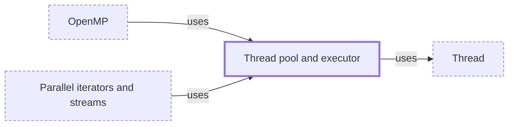

# Thread pool and executor

**Category:** [Units of execution](../README.md) · **Status:** stub · **Lessons:** [chapter 01, Threads](../../../01_Threads/README.md)

**One line:** A set of threads that run submitted tasks one after another, so the cost of starting a thread is paid once rather than once per task.

Also called: executor, ExecutorService, ThreadPoolExecutor.

## How it connects

- **Is built on:** [Thread](../thread/README.md)
- **Is used by:** [OpenMP](../../parallelism/openmp/README.md), [Parallel iterators and streams](../../parallelism/parallel_iterators/README.md)
- **See also:** [Concurrency primitives](../../foundations/concurrency_primitives/README.md), [Oversubscription](../../foundations/oversubscription/README.md), [Work stealing](../../scheduling/work_stealing/README.md), [Worker pool](../../communication/worker_pool/README.md)

## In each language

| | |
|---|---|
| Rust | None in the standard library; the Rayon crate has [`ThreadPool` ↗](https://docs.rs/rayon/latest/rayon/struct.ThreadPool.html) |
| Go | No pool type: a fixed number of goroutines receiving from one channel, as in [bounded parallelism ↗](https://go.dev/blog/pipelines) |
| Java | [`ExecutorService` ↗](https://docs.oracle.com/en/java/javase/25/docs/api/java.base/java/util/concurrent/ExecutorService.html), from the [`Executors` ↗](https://docs.oracle.com/en/java/javase/25/docs/api/java.base/java/util/concurrent/Executors.html) factories or [`ThreadPoolExecutor` ↗](https://docs.oracle.com/en/java/javase/25/docs/api/java.base/java/util/concurrent/ThreadPoolExecutor.html) |
| Python | [`ThreadPoolExecutor` ↗](https://docs.python.org/3/library/concurrent.futures.html#threadpoolexecutor) and `ProcessPoolExecutor` |
| C# | The [managed thread pool ↗](https://learn.microsoft.com/en-us/dotnet/standard/threading/the-managed-thread-pool): one per process, used by `Task` |
| Kotlin | [`Dispatchers.Default` ↗](https://kotlinlang.org/api/kotlinx.coroutines/kotlinx-coroutines-core/kotlinx.coroutines/-dispatchers/-default.html) and `Dispatchers.IO` are shared pools of threads |
| Swift | [Dispatch ↗](https://developer.apple.com/documentation/dispatch) queues, run on threads the system manages |

## Where to read more

- **In this library:** [Getting a result back](../../../01_Threads/getting_a_result_back/README.md)
- **In this library:** [How many threads can you start?](../../../01_Threads/how_many_threads_can_you_start/README.md)
- **In this library:** [Why reuse a thread at all?](../../../01_Threads/reusing_threads_in_a_pool/README.md)
- **In this library:** [How do N workers share one queue of jobs?](../../../05_Message_Passing/a_worker_pool/README.md)
- **In this library:** [How does one thread watch a thousand sockets?](../../../06_Async/io_multiplexing_under_the_loop/README.md)
- **In this library:** [How does a recursive job split itself across cores?](../../../07_Parallelism/fork_join/README.md)
- **In this library:** [How many workers should a pool have?](../../../07_Parallelism/how_many_workers/README.md)
- **In this library:** [How do you read a thread dump?](../../../09_Testing_and_Tools/reading_a_thread_dump/README.md)
- **In a sibling library:** [Go: A worker pool ↗](https://masiarek.github.io/go-learning-library/06_Patterns/a_worker_pool/index.html)
- **In the books:** [*Hands-On Concurrency with Rust*](../../../10_Resources/books_rust/README.md#troutwine_hands_on_concurrency_with_rust), Brian L. Troutwine — ch. 8, 'High-Level Parallelism – Threadpools, Parallel Iterators and Processes'
- **In the books:** [*Java Concurrency in Practice*](../../../10_Resources/books_java/README.md#goetz_java_concurrency_in_practice), Brian Goetz, Tim Peierls, Joshua Bloch, Joseph Bowbeer, David Holmes, Doug Lea — ch. 8, 'Applying Thread Pools'
- **In the books:** [*Concurrent Programming on Windows*](../../../10_Resources/books_csharp_dotnet/README.md#duffy_concurrent_programming_on_windows), Joe Duffy — ch. 7, 'Thread Pools'
- **In the books:** [*Parallel Loops in Python*](../../../10_Resources/books_python/README.md#brownlee_parallel_loops_in_python), Jason Brownlee — ch. 3, 'Parallel Loop with the ThreadPool Class'
- **In the books:** [*Pthreads Programming*](../../../10_Resources/books_c/README.md#nichols_pthreads_programming), Bradford Nichols, Dick Buttlar, Jacqueline Proulx Farrell — ch. 3, 'Synchronizing Pthreads' → 'Thread Pools'
- **In the books:** [*C++ Concurrency in Action*](../../../10_Resources/books_cpp/README.md#williams_cpp_concurrency_in_action), Anthony Williams — ch. 9, 'Advanced thread management' → 'Thread pools'
- **In the books:** [*Fluent Python*](../../../10_Resources/books_python/README.md#ramalho_fluent_python), Luciano Ramalho — ch. 20, 'Concurrent Executors'
- **In the books:** [*Effective Java*](../../../10_Resources/books_java/README.md#bloch_effective_java), Joshua Bloch — ch. 11, 'Concurrency' → 'Item 80: Prefer executors, tasks, and streams to threads'
- **In the books:** [*Learning Concurrent Programming in Scala*](../../../10_Resources/books_scala_jvm_functional/README.md#prokopec_learning_concurrent_programming_in_scala), Aleksandar Prokopec — ch. 3, 'Traditional Building Blocks of Concurrency' → 'The Executor and ExecutionContext objects'
- **Reference:** [Wikipedia: Thread pool ↗](https://en.wikipedia.org/wiki/Thread_pool)

<!-- Generated above this line by tools/build_concepts.py from TOML data — edit the data, not the page. Hand-written notes go below it and are kept. -->
