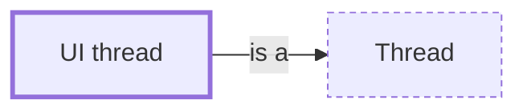

# UI thread

**Category:** [Units of execution](../README.md) · **Status:** stub · **Lessons:** [chapter 06, Async](../../../06_Async/README.md)

**One line:** The one thread a graphical toolkit allows to touch its widgets: long work goes to other threads or tasks, and its results are posted back to that thread.

Also called: main thread, event dispatch thread, GUI thread.

## How it connects

- **Is a kind of:** [Thread](../thread/README.md)
- **See also:** [Blocking the event loop](../../async/blocking_the_event_loop/README.md), [Event loop](../../scheduling/event_loop/README.md), [Thread confinement](../../safety_in_languages/thread_confinement/README.md)

## In each language

| | |
|---|---|
| Java | Swing's event dispatch thread: [`SwingUtilities.invokeLater` ↗](https://docs.oracle.com/en/java/javase/25/docs/api/java.desktop/javax/swing/SwingUtilities.html) runs code on it |
| C# | [`Control.Invoke` ↗](https://learn.microsoft.com/en-us/dotnet/api/system.windows.forms.control.invoke) runs a delegate on the thread that owns a Windows Forms control |
| JavaScript | the [main thread ↗](https://developer.mozilla.org/en-US/docs/Glossary/Main_thread), where the browser runs user code, handles events and renders; web workers run elsewhere |
| Swift | [`MainActor` ↗](https://developer.apple.com/documentation/swift/mainactor), the global actor that performs its tasks on the main thread |

## Where to read more

- **In this library:** [Why may only one thread touch the user interface?](../../../06_Async/the_ui_thread/README.md)
- **In the books:** [*Java Concurrency in Practice*](../../../10_Resources/books_java/README.md#goetz_java_concurrency_in_practice), Brian Goetz, Tim Peierls, Joshua Bloch, Joseph Bowbeer, David Holmes, Doug Lea — ch. 9, 'GUI Applications'
- **In the books:** [*Concurrent Programming on Windows*](../../../10_Resources/books_csharp_dotnet/README.md#duffy_concurrent_programming_on_windows), Joe Duffy — ch. 16, 'Graphical User Interfaces'
- **In the books:** [*Parallel Programming and Concurrency with C# 10 and .NET 6*](../../../10_Resources/books_csharp_dotnet/README.md#ashcraft_parallel_programming_concurrency_csharp10), Alvin Ashcraft — ch. 4, 'User Interface Responsiveness and Threading'
- **In the books:** [*Pro Asynchronous Programming with .NET*](../../../10_Resources/books_csharp_dotnet/README.md#blewett_clymer_pro_asynchronous_programming_dotnet), Richard Blewett, Andrew Clymer — ch. 6, 'Asynchronous UI'
- **In the books:** [*Kotlin Coroutines by Tutorials*](../../../10_Resources/books_other/README.md#babic_srivastava_kotlin_coroutines_by_tutorials), Filip Babić, Nishant Srivastava — ch. 1, 'What Is Asynchronous Programming' → 'Interacting with the UI thread from the background'
- **In the books:** [*C++ Reactive Programming*](../../../10_Resources/books_cpp/README.md#pai_abraham_cpp_reactive_programming), Praseed Pai, Peter Abraham — ch. 9, 'Reactive GUI Programming Using Qt/C++'

<!-- Generated above this line by tools/build_concepts.py from TOML data — edit the data, not the page. Hand-written notes go below it and are kept. -->
